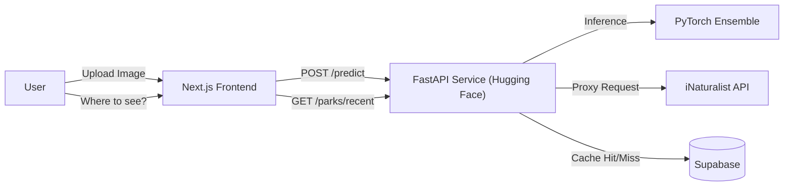

# aniML vision 🦁

A robust, full-stack application that uses **Computer Vision** (PyTorch) to identify wildlife species and a **Real-time Backend Proxy** to locate recent sightings in national parks.


## 🚀 Live Demo
- **Frontend**: [https://wildlife-id.vercel.app](https://wildlife-id.vercel.app) (Replace with your Vercel URL)
- **AI Backend**: [https://huggingface.co/spaces/raza44/aniML](https://huggingface.co/spaces/raza44/aniML)

## 🛠️ Tech Stack

### Frontend
- **Framework**: Next.js 14 (App Router)
- **Language**: TypeScript
- **Styling**: Tailwind CSS
- **Maps**: Leaflet.js
- **Auth**: Supabase Auth

### Backend & AI
- **API**: FastAPI (Python)
- **Computer Vision**: PyTorch, TorchVision
- **Architecture**: Late Fusion Ensemble (EfficientNet-B3 + ConvNeXt)
- **Hosting**: Hugging Face Spaces (Docker)

### Data
- **Database**: Supabase (PostgreSQL)
- **External API**: iNaturalist (Real-time Observation Data)

## 💡 Key Features

### 1. AI Species Identification
Upload an image of an animal, and the custom-trained ensemble model (trained on 100+ North American species) identifies it with expert-level accuracy. It handles confusion pairs (e.g., Wolf vs. Coyote) using a specialized **Expert Override** logic.

### 2. "Where to See" (Real-time Park Locator)
Instead of relying on stale databases, the app uses a custom **Backend Proxy** to:
- Fetch the last 600 raw observations of a species from iNaturalist.
- Handle API rate-limiting and pagination securely.
- Aggregate observations by valid park boundaries (National Parks).
- Sort active hotspots by distance from the user.

### 3. Smart Caching
Uses Supabase to cache common queries, ensuring the application remains fast and responsive while minimizing external API load.

## 🏗️ Architecture



## 📦 Local Development

### 1. Clone & Install
```bash
git clone https://github.com/razamalik7/wildlife-id.git
cd wildlife-id
```

### 2. Backend (FastAPI)
```bash
cd api
pip install -r requirements.txt
python -m uvicorn main:app --reload
```

### 3. Frontend (Next.js)
```bash
cd frontend
npm install
npm run dev
```

## 📄 License
MIT
